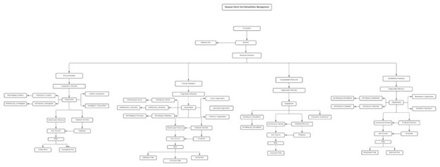

# Final project

## Authors

Ankita Kumari
Gaurav Srivastav
Hazel Lobo

## Project title - Disaster Relief and Rehabilitation Management

## Project details

What is Disaster Relief and Rehabilitation Management ?

Disaster Relief and Rehabilitation System addresses the immediate and short-term needs of disaster-affected communities. It provides services such as rescuing people and providing medical assistance as per requirement and allocating housing to affected families.

